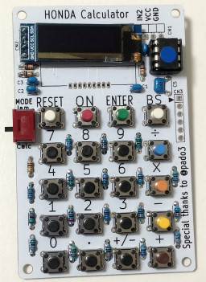

# ATtiny85RpnCalc

A RPN Calculator with ATtiny85.

* 8 significant digits.
* 16 Levels stack with overflow prevention.

## Instruction

* 0~9, ., &plus;/&minus;
  * Edit the current number.
  * If it is determined, it's pushed into the stack and a new number is edited.
* Enter
  * Determine the current number.
  * If it is already determined, it's duplicated and pushed into the stack.
* &plus;, &minus;, &times;, &div;
  * Pop a number from the stack and operate with the current number.
* Clear
  * Clear the current number and pop a number from the stack.
  * All clear if this button is held long.

## Hardware

### Schematic

## Software

### Build enviroment

[Install ATTinyCore boards to the Arduino IDE](https://github.com/SpenceKonde/ATTinyCore/blob/master/Installation.md) and configure the settings as follows.

Attribute        |Value
-----------------|------------------------------
Board            |ATtiny25/45/85 (No bootloader)
Chip             |ATtiny85
Clock            |4 MHz (Internal)
B.O.D. Level     |B.O.D. Disabled (saves power)
Save EEPROM      |EEPROM not retained
Timer 1 Clock    |CPU (CPU frequency)
LTO              |Enabled
millis()/micros()|Disabled

### Acknowledgement

* [SimpleWire.h](https://lab.sasapea.mydns.jp/2020/03/11/avr-i2c-2/)
  * Copyright (c) 2020 Sasapea's Lab. All right reserved.

### License

These codes are licensed under [MIT License](LICENSE).

## References

* [nekopla/simple_rpn_calc](https://github.com/nekopla/simple_rpn_calc)
* [pado3/tinyRPN](https://github.com/pado3/tinyRPN)

